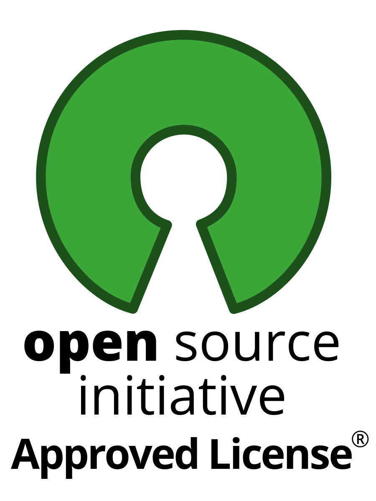

# Contributing

## First Things First

1. New to \#techforgood projects? take a look at the [Solutions for Humanity website](https://forhumanity.org.au).
2. New to open source? take a look at [How to Contribute to an Open Source Project on GitHub](https://egghead.io/courses/how-to-contribute-to-an-open-source-project-on-github)
3. Familiarize yourself with the [isgood.ai Code of Conduct](code-of-conduct.md)
4. Learn [how the community operates](https://isgood.ai/toolbox/)

## Overview of our Codebase

The greater isgood.ai project has 3 layers:

1. WebApp Presentation Layer.
2. Backend, API and Data-Service Layer.
3. AI & Data-Platform Layer.

Layer 1 defaults to javascript, while layer 3 defaults to python.  Layer 2 is a combination of javascript, python and open-api standards.


Tech stack on Stackshare -&gt; [https://stackshare.io/isgood-ai/beta](https://stackshare.io/isgood-ai/beta)


Collaborative decision making about tech stack decisions made on our [Loomio](https://www.loomio.org/sfh-isgood-ai-product/).

As general outline, our contributors spend most time with [Node](https://nodejs.org/), [React](https://reactjs.org/) & [Python](https://www.python.org/) coding languages, [PostgerSQL](https://www.postgresql.org/) and [Prisma](https://www.prisma.io/), along with [Material-UI](https://next.material-ui.com/).    
Our app base is [Blitz.js](https://blitzjs.com), so you MUST be familiar with this.   

note: _love the Blitz.js inclusive community and tech approach. If we find issues or can add back to this project and community, it would be very cool to do so_😍

## Open-Source Public-Good Principles

As a \#techforgood project, we have agreed to the [Digital Development Principles and Open-Source Licensing](https://www.loomio.org/d/C2gOcrqu/digital-development-principles-and-licensing), at all times when it is in the public interest and for the public good.  In effect, this means by default all of our code and scripts are [open-source by default](https://www.loomio.org/p/Kr1SHvs5/open-community-licence-where-applicable) , with a review of any private-repo scripts every 6 months to enable them to become open-source where public benefit outweighs risk.🎯 _isgood.ai risk work-group will be publish more info on isgood.ai website._

## Code Management Best Practices

### Coding Style & Commenting

We encourage you to follow the following general guidelines to help you team mates and leave behind code that can be worked with in the future by other developers.

* Do not write excessively long lines of complex code. Split them out into multiple lines. Today's compilers do not benefit much from dumping everything in one long line of code
* Remember that the people coming behind you also need to understand your code, they may not necessarily be at the same level as you so keep complexity to a case where it absolutely demonstrates tangible benefits.
* **Comment. Comment. Comment.** Explain why you did something and any other options you may have considered. Do this in an obvious comment block that stands out. It will likely help solve a future bug or a feature enhancement.
* We use an automatic code formatter called [Prettier](https://prettier.io/). Run `yarn prettier` after making any changes to the code. You can check the status of your code styling by simply running `yarn linc`.  If you are unsure about something, looking at [Airbnb’s Style Guide](https://github.com/airbnb/javascript) will guide you in the right direction.

## Making a Contribution

When you are making a contribution, it will normally be done as a pull-request from a branch that contains your edits \([see github docs](https://opensource.guide/how-to-contribute/#opening-a-pull-request)\).

A pull request doesn’t have to represent finished work. It’s usually better to open a pull request early on, so others can watch or give feedback on your progress. Just mark it as a “WIP” \(Work in Progress\) in the subject line. You can always add more commits later.

💡 Here’s how to contribute code and submit a pull request:

* [**Fork the repository**](https://guides.github.com/activities/forking/) and clone it locally. Connect your local to the original “upstream” repository by adding it as a remote. Pull in changes from “upstream” often so that you stay up to date so that when you submit your pull request, merge conflicts will be less likely. \(See more detailed instructions [here](https://help.github.com/articles/syncing-a-fork/).\)
* [**Create a branch**](https://guides.github.com/introduction/flow/) for your edits.
* **Reference any relevant issues** or supporting documentation in your PR \(for example, “Closes \#37.”\)
* **Include screenshots of the before and after** if your changes include differences in HTML/CSS. Drag and drop the images into the body of your pull request.
* **Test your changes!** Run your changes against any existing tests if they exist and create new ones when needed. Whether tests exist or not, make sure your changes don’t break the existing project. We highly recommend peer-review of your code and contributions ... we're a super-welcoming community, and love to help each other out 😍 
* **Contribute in the style of the project** to the best of your abilities. This may mean using indents, semi-colons or comments differently than you would in your own repository, but makes it easier for the maintainer to merge, others to understand and maintain in the future.

If this is your first pull request, check out [Make a Pull Request](http://makeapullrequest.com/), which [@kentcdodds](https://github.com/kentcdodds) created as a walkthrough video tutorial. You can also practice making a pull request in the [First Contributions](https://github.com/Roshanjossey/first-contributions) repository, created by [@Roshanjossey](https://github.com/Roshanjossey).

